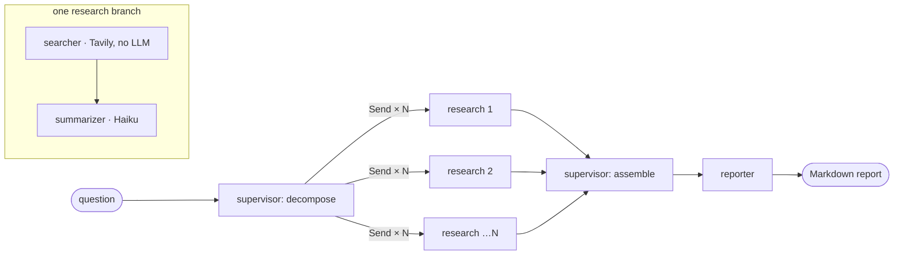

# Research Synthesis Agent

Ask an open-ended question; get back a **sourced, structured research brief** in ~20 seconds for
~3 cents. A supervisor agent splits the question into 3–5 sub-questions, dispatches parallel
searcher + summarizer workers, then assembles an executive summary, per-topic sections with
citations, and a conclusion. Every LLM call is cost-tracked to the cent, and every step is
traced in Langfuse.

Built as Project 1 of a multi-agent learning portfolio — a hands-on study of the two foundational
LangGraph patterns (**parallel fan-out / fan-in** and **supervisor / worker**) plus
observability and cost discipline as day-one habits.

---

## The problem it solves

First-pass research is slow and repetitive: pick apart a question, run a handful of searches,
skim the results, and stitch them into something readable with sources attached. This automates
that *first draft* — decompose → search → summarize → synthesize — so a human starts from a
sourced skeleton instead of a blank page.

It **drafts**; it doesn't replace judgment. Source quality varies (see [Failure Modes](#failure-modes)),
so the output is a starting point a human verifies — not a final answer.

---

## How it works



- **Fan-out / fan-in** — the supervisor emits one `Send` per sub-question, so all research
  branches run *in parallel*. LangGraph waits for every branch (fan-in), then continues.
  Results accumulate through `Annotated[list, operator.add]` reducers instead of overwriting.
- **Supervisor / worker** — one "boss" model appears twice (decompose, then assemble); cheap
  workers do the bounded, parallel labor in between.
- **Per-stage model routing** — reasoning-heavy stages (decompose, assemble) use
  **Claude Sonnet 5**; bounded summarization uses **Claude Haiku 4.5**. Matching the model to the
  job is a correctness *and* cost lever, not just a cost one.

| Stage | Model | Job | Failure policy |
|-------|-------|-----|----------------|
| `decompose` | Sonnet 5 | Split into 3–5 researchable sub-questions (Pydantic-validated) | **Fail fast** — no valid split, no run |
| `searcher` | *none* (Tavily) | Fetch web results; retry once on 429/5xx | Degrade — set `error`, never crash |
| `summarizer` | Haiku 4.5 | Condense one section from its search results | Degrade — write a confidence note |
| `assemble` | Sonnet 5 | Write executive summary + conclusion | Degrade — ship sections without framing |
| `reporter` | *none* (pure) | Assemble Markdown + cost table | Deterministic |

---

## Quick start

```bash
uv sync                         # install the locked dependency set
cp .env.example .env            # then fill in your API keys (see below)
uv run python -m src.main "How do electric cars work?"
```

The report prints to stdout and is saved to `outputs/`. A one-line cost summary is appended to
[`docs/cost-breakdown.md`](docs/cost-breakdown.md).

**Keys** (`.env`): `ANTHROPIC_API_KEY` and `TAVILY_API_KEY` are required. Langfuse keys
(`LANGFUSE_PUBLIC_KEY`, `LANGFUSE_SECRET_KEY`, `LANGFUSE_HOST`) are **optional** — without them,
cost tracking still works locally and tracing simply no-ops.

---

## Sample output

Excerpt from `"How do electric cars work?"` (full report in `outputs/`):

> ## What are the main components of an electric car …?
>
> An electric car's powertrain consists of four critical components … The **battery pack** …
> stores electrical energy and powers the entire system. The **electric motor** converts this
> electrical energy into mechanical power … The **inverter** controls electricity flow between
> the battery and motor … the **controller** manages the overall electrical system …
>
> **Sources:**
> - [EV A to Z Encyclopedia — Hyundai Motor Group](https://www.hyundaimotorgroup.com/en/story/electric-vehicle-encyclopedia-ev-driving-principle)
> - [How Electric Vehicles Work — SEAI](https://www.seai.ie/plan-your-energy-journey/for-your-home/electric-vehicles/about-evs/how-electric-vehicles-work)

Each run ends with an in-report **cost table** (per-node tokens + USD) and a total.

### Real runs

Logged automatically to `docs/cost-breakdown.md` — every run so far, unedited:

| Question | Sub-questions | Cost | Latency |
|----------|:-------------:|:----:|:-------:|
| How do electric cars work? | 5 | $0.0322 | 18.5s |
| How do electric cars work? | 5 | $0.0313 | 20.1s |
| How do mechanical watches work? | 5 | $0.0288 | 18.0s |
| Can you recommend a GMT watch with heritage? | 5 | $0.0356 | 22.0s |

**≈ $0.032 and ≈ 20 seconds per report.** Cost scales predictably with the number of
sub-questions (each adds one Haiku summarization).

---

## Business Impact

Per-query economics: **~$0.03 and ~20 seconds** for a sourced, structured first draft. Two
plausible ways that maps to value:

- **Research analyst throughput.** An analyst producing ~20 research briefs/week spends roughly
  30–45 minutes per brief on the first-pass gathering-and-structuring step. Drafting that pass
  automatically costs **~$0.60/week in API spend** and reclaims **~10–15 hours/week** for the
  work only a human can do — verifying claims, weighing sources, adding judgment. The bottleneck
  shifts from *gathering* to *checking*.
- **Internal enablement / onboarding.** Generating 100 sourced "how does X work" explainers for
  a knowledge base costs **~$3 total** and lands in minutes rather than days — a cost rounding
  error against the staff time it replaces.

The honest caveat *is* the value proposition: because every claim carries its source and the
system flags under-sourced sections instead of bluffing, a human can verify in a fraction of the
time it would take to research from scratch. It's a force multiplier on repetitive first-pass
research, not an oracle.

---

## Failure Modes

The "unhappy path" is a first-class feature. Each failure has a defined, tested behavior — the
system degrades gracefully where it safely can, and fails loudly where it must.

| Failure | Behavior | Why |
|---------|----------|-----|
| **Search returns off-topic junk** | Summarizer writes a confidence note ("results are off-topic"); the run continues | An honest gap beats a confident hallucination. *This fired on the very first live run* — one sub-question got dictionary definitions of the word "how", and the report said so plainly. |
| **Tavily 429 / 5xx / timeout** | Retry once with backoff, then set `SearchResult.error`; summarizer degrades | One flaky search must not sink the whole report |
| **Decompose output malformed** | Pydantic rejects → **run aborts** | Decompose is *essential* — no valid split means no meaningful report. Fail fast. |
| **Assemble output malformed / model error** | Degrade to empty intro/conclusion; report ships with its sections | Framing prose is *non-essential* — the sourced sections still deliver |
| **Configured model has no pricing** | `validate_models` **fails fast at startup** | Otherwise every call to that model would silently log $0 cost |
| **Langfuse down or keys absent** | Tracing no-ops; cost log + run complete normally | Observability is optional infrastructure, never a hard dependency |
| **Runaway fan-out** | `max_sub_questions` cap + `recursion_limit=25` | Bounds cost and prevents pathological loops |
| **Malicious scraped title/URL** | Reporter escapes brackets + allowlists `http(s)` schemes | A web result can't forge a link or inject `javascript:` into the Markdown |

---

## Defend as an Engineer / Defend as a Stakeholder

**As an engineer.** This is a LangGraph `StateGraph` built on two patterns: `Send`-based fan-out
with `operator.add` reducers for lock-free parallel accumulation, and a supervisor/worker split
that isolates expensive reasoning from cheap, bounded labor. Every stage is a *deep module* — a
prompt, a strict Pydantic output contract, a model, and its own failure policy behind one
interface — so each is testable in isolation with its network boundary injected (the whole suite
is hermetic and runs in under a second, no live API). Model routing is per-stage (Sonnet 5 for
decompose/assemble, Haiku for summarization). Cost accounting flows through a single choke point
with one source-of-truth pricing table; observability is optional OpenTelemetry tracing that
no-ops without keys. Correctness is guarded by a deterministic floor — `ruff` + `mypy` + `pytest`
— and every chunk shipped through a red/green TDD loop plus an adversarial review pass.

**As a stakeholder.** It turns an open-ended question into a sourced, structured brief in about
20 seconds for about three cents — and every one of those cents and every source is auditable.
Cost per query is predictable and logged; failures are transparent (it tells you when a section
is thin instead of making something up); and every run leaves a full trace for debugging or
compliance. For anyone who does repetitive first-pass research, it converts a 30-minute task into
a 20-second draft plus a short human review — turning research time into judgment time.

---

## What's next (out of scope for Project 1)

- **Answer-quality evaluation** — an LLM-as-judge scoring faithfulness / relevance / completeness /
  coherence, calibrated against a small human-graded set. (The natural Project 2.)
- Source reranking and credibility filtering (some runs surfaced forum/Q&A links).
- Human-in-the-loop review, memory/caching of past reports, a private knowledge base.

---

## Project layout

```
src/
  config.py         # typed settings (pydantic-settings) — API keys, model IDs, limits
  state.py          # graph state (TypedDict) + operator.add reducers
  observability.py  # cost math, cost log, optional Langfuse client (single source of pricing)
  agents/
    supervisor.py   # decompose (fail-fast) + assemble (degrade)
    searcher.py     # Tavily worker — no LLM
    summarizer.py   # Haiku worker
  graph.py          # StateGraph: Send fan-out, reducer fan-in, routing
  report.py         # pure Markdown reporter (injection-safe source links)
  main.py           # CLI entrypoint
docs/cost-breakdown.md   # one row appended per run
```

## Development

```bash
.claude/verify.sh          # the floor: ruff + mypy + pytest
uv run pytest -q           # tests only (hermetic — no network)
```

## Tech stack

Python 3.12 · [uv](https://docs.astral.sh/uv/) · LangGraph 1.x · langchain-anthropic 1.x ·
Anthropic (Sonnet 5 + Haiku 4.5) · Tavily · Langfuse v4 · Pydantic v2 · pytest · ruff · mypy
